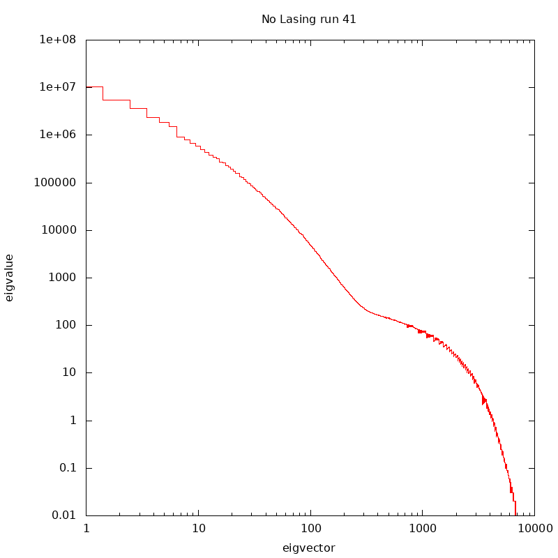

#Vernier scanning res-Auger N2O
```bash
sbatch -p psanaq --mem-per-cpu=16GB --gpus-per-node=0 --wrap='/cds/home/c/coffee/analysis_2022/x42619/src/hits2h5.py 35000 tmox42619 316 219 220 221 222 223 224 225 226 227 228 229 230 231 232 233 234 235 236 237 238 239 240 241 242'
sbatch -p psanaq --mem-per-cpu=16GB --gpus-per-node=0 --wrap='/cds/home/c/coffee/analysis_2022/x42619/src/hits2h5.py 35000 tmox42619 243 244 245 246'
sbatch -p psanaq --mem-per-cpu=16GB --gpus-per-node=0 --wrap='/cds/home/c/coffee/analysis_2022/x42619/src/hits2h5.py 35000 tmox42619 247 248 249 250 251 252 253 254'
sbatch -p psanaq --mem-per-cpu=16GB --gpus-per-node=0 --wrap='/cds/home/c/coffee/analysis_2022/x42619/src/hits2h5.py 35000 tmox42619 255 256 258 259 260 261 262 263 257'
```

# Hacking multicolor
## Nitrogen (maybe N-=edge of N2O
Hacking the two-color from runs 316 and 313 for Razib SASE reconstruction with Auger.  

runs: 313 316 315 314
photon  energies:408 404 408 408
rets: 300 300 350 370

## Argon
Photonenergies 600eV, 500eV, 400eV, 700eV  
All 0V retardation: Runs 7 21 36 59    
50V retardation: Runs 8 23 39 61
100V retardation: Runs 9 26 42 62  
150V retardation: Runs 10 28 -- 63
175V retardation: Runs 11 29 --

Careful, the runs of 100eV different photon energies had different vls pitches, so that needs to be calibrated instead of blindly added as doing now.  


## Neon
Watch it... vls pitch changed between run 86 and 87... careful!  
Furthermore, having trouble with evt in run 86 for some reason.
All 0V retardation.  
photon energies: 920 915 910 905 [900] 895 890 885 880 875 870 850
runs: 82 83 84 85 [86] 87 88 89 90 93 94 95
vls pitch: 6.9 6.9 6.9 6.9 6.9 6.8 6.8 6.8 6.8 6.8 6.8 6.8       


# Beamtime  
This repo is predominantly for analysis of the lcls x42619 beamtime performed end of June 2021.  
This will also host code that analyzes for the xcomm118 for runs in the 400's since that was the commissioning shifts.  

# setting up  
First set the configuration .h5 file with something like this...
```bash
./src/set_configs.py /reg/data/ana16/tmo/tmox42619/scratch/ryan_output_2022/h5files/tmox42619.hsdconfig.h5
```
Here one must be sure that the file written is indeed what will be read in ```./src/hits2h5.py```
the ```expname``` gets used to pull the config file, at least until we implement the parser.  

```bash
scratchpath=/reg/data/ana16/tmo/tmox42619/scratch/ryan_output_2022/h5files
expname=tmox42619
runnum=23
shots=100
./src/set_configs.py ${scratchpath}/${expname}.hsdconfig.h5
./src/hits2h5.py ${expname} ${runnum} ${nshots}
```

# using slurm  
```bash
sbatch -p psanaq --nodes 1 --ntasks-per-node 1 --wrap="./src/hits2h5.py tmox42619 23 10000"
coffee@psanagpu103:x42619$ for id in 21 22 23 25 26 27 28 29 30; do sbatch -p psanaq --nodes 1 --ntasks-per-node 1 --mem-per-cpu=8GB --gpus-per-node=0 --wrap="/cds/home/c/coffee/analysis_2022/x42619/src/hits2h5.py tmox42619 $id 40000"; done
```

# Fitting Argon Calibrations
The first line creates the calibration file based on the hard coded *hand calibrated-by ryan* values for the argon Auger-Meitner lines near 200-210eV (for 600eV photon energy so far).  
The second line then fits those values and writes the resulting quadratic fit to a file 'calibfit.h5'.  
```bash
./src/argon.calib.auger.py /media/coffee/dataSD/ryan_output_2022/calib/argon.calib.20220411.h5
./src/argon.calib.auger.fitting.py /media/coffee/dataSD/ryan_output_2022/calib/argon.calib.20220411.h5
```
Inside ```./src/argon.calib.auger.fitting.py``` there are both fit() and transform() methods.  These I plan to make compatible with import for post processing the 'tofs' arrays in the hits2h5.py result.

Apr14 The scirpt ```./src/apply_calib.py``` is not finished... still need to output the spectra (histograms) for each of the ports.  I left my usual HERE HERE HERE in there to make the code fail there.  

OK, this is how I ran before:
```bash
for id in 21 22 23 25 26 27 28 29 30; do sbatch -p psanaq --nodes 1 --ntasks-per-node 1 --mem-per-cpu=32GB --gpus-per-node=0 --wrap="/cds/home/c/coffee/analysis_2022/x42619/src/hits2h5.py tmox42619 $id 40000"; done
```

# Xtcav 

## Eigenfaces approach
Use logarithmic eigenvals representaiton,  
fit with a low order polynomial for below i = 300 and above.  
use the fits to produce a "weiner filter"  
Then approximate the weiner filter with a reverse sin() version of the erf()... e.g. 1 if i<icen-w;0 if i>icen+w; otherwise 0.5*( 1.-sin(pi/2*(i-icen)/w) )  
this icen+w is also where we truncate the eigvecs, beyond this is out of signal.  


Eigenvalues for Run 41 nolasing 

## running eigen\_xtcav.py with slurm
```bash
sbatch -p psanaq --nodes 1 --ntasks-per-node 16 --mem-per-cpu=16GB --gpus-per-node=0 --wrap="./src/eigen_xtcav.py /reg/data/ana16/tmo/tmox42619/scratch/ryan_output_2022/h5files/hits.tmox42619.run41.h5 /reg/data/ana16/tmo/tmox42619/scratch/ryan_output_2022/xtcav"
```

